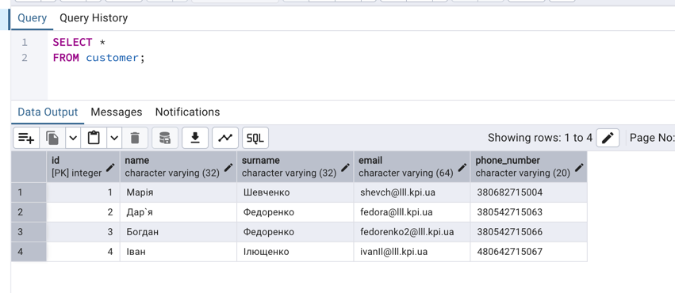
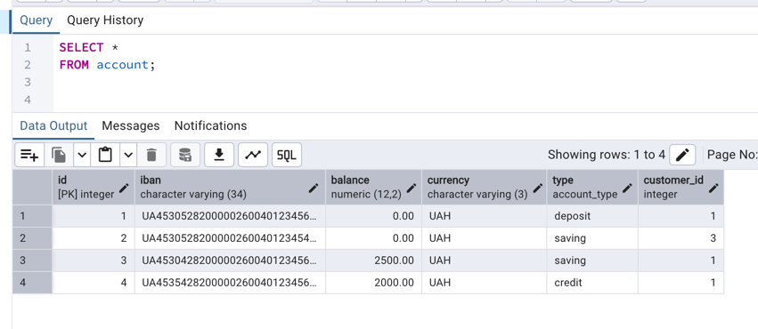
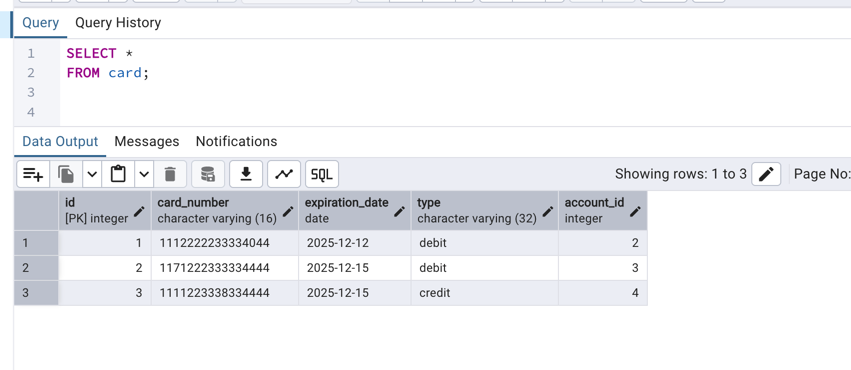
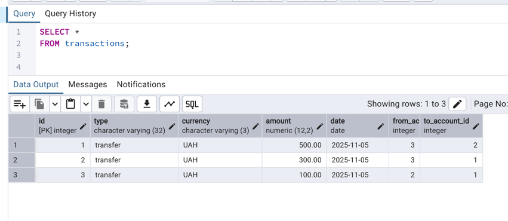
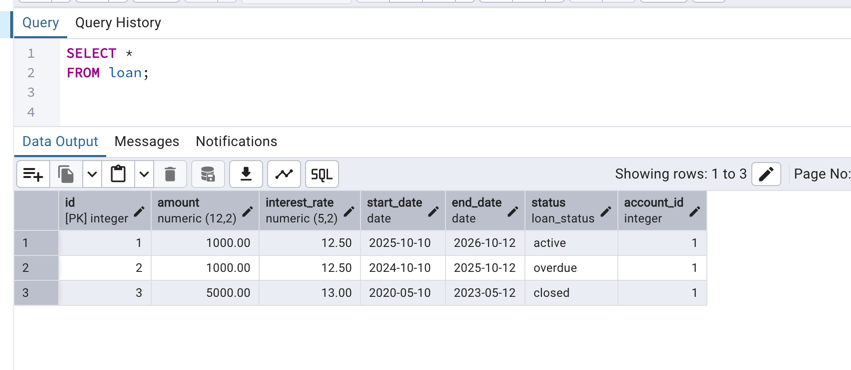

# Lab2

---

## Мета роботи
Розробити SQL DDL-скрипти для створення структури бази даних, що реалізує логіку банківської системи.  
Визначити таблиці, типи даних, ключі, обмеження та зв’язки між таблицями.  
Заповнити базу тестовими даними та перевірити коректність зв’язків і обмежень.

---

## Опис системи
Система **онлайн-банкінгу** призначена для управління фінансами користувачів.  
Вона дозволяє клієнтам:
- переглядати баланс і історію транзакцій;
- здійснювати перекази між рахунками;
- користуватися платіжними картками;
- оформлювати позики.

---

##  Структура бази даних

### **1. Customer**
Зберігає дані про клієнтів банку.

| Поле | Тип | Обмеження | Опис |
|------|------|------------|------|
| id | SERIAL | PRIMARY KEY | Унікальний ідентифікатор клієнта |
| name | VARCHAR(32) | NOT NULL | Ім’я клієнта |
| surname | VARCHAR(32) | NOT NULL | Прізвище |
| email | VARCHAR(64) | UNIQUE, NOT NULL | Електронна адреса клієнта (повинна бути унікальною) |
| phone_number | VARCHAR(20) | NOT NULL | Номер телефону клієнта |

**Коментарі та обмеження:**
- Кожен клієнт має унікальний `email`, що запобігає дублям.
- Поля `name`, `surname`, `email`, `phone_number` обов’язкові до заповнення.
- Один клієнт може мати кілька рахунків.
- Використовується для зв’язку 1→N із таблицею **account**.

---

### **2. Account**
Інформація про банківські рахунки клієнтів.

| Поле | Тип | Обмеження | Опис |
|------|------|------------|------|
| id | SERIAL | PRIMARY KEY | Ідентифікатор рахунку |
| iban | VARCHAR(34) | UNIQUE, NOT NULL | Міжнародний номер банківського рахунку (IBAN) |
| balance | DECIMAL(12,2) | DEFAULT 0, CHECK(balance ≥ 0) | Поточний баланс рахунку |
| currency | VARCHAR(3) | NOT NULL | Код валюти рахунку (UAH, USD тощо) |
| type | ENUM(account_type) | NOT NULL | Тип рахунку (`credit`, `saving`, `deposit`) |
| customer_id | INT | FOREIGN KEY → customer(id) | Ідентифікатор власника рахунку |

**Коментарі та обмеження:**
- Баланс не може бути від’ємним завдяки `CHECK(balance ≥ 0)`.
- Тип рахунку обмежений `ENUM(account_type)` (лише три можливі значення).
- `customer_id` встановлює зв’язок з таблицею **customer** (1 клієнт → N рахунків).
- Можливі сценарії:
    - `credit` — рахунок із кредитним лімітом;
    - `saving` — накопичувальний рахунок;
    - `deposit` — депозитний рахунок із фіксованою сумою.

---

### **3. Card**
Інформація про платіжні картки, пов’язані з рахунками.

| Поле | Тип | Обмеження | Опис |
|------|------|------------|------|
| id | SERIAL | PRIMARY KEY | Ідентифікатор картки |
| card_number | VARCHAR(16) | UNIQUE, NOT NULL | Номер картки (16 цифр, унікальний) |
| expiration_date | DATE | NOT NULL | Дата закінчення терміну дії картки |
| type | VARCHAR(32) | NOT NULL | Тип картки (`debit` або `credit`) |
| account_id | INT | FOREIGN KEY → account(id) | Рахунок, до якого належить картка |

**Коментарі та обмеження:**
- Одна картка належить лише одному рахунку.
- Один рахунок може мати кілька карток.
- `card_number` повинен бути унікальним, щоб уникнути конфліктів.
- `expiration_date` контролює строк дії картки.
- Використовується зв’язок 1 → N між **account** і **card**.

---

### **4. Transactions**
Зберігає всі фінансові операції (перекази між рахунками).

| Поле | Тип | Обмеження | Опис |
|------|------|------------|------|
| id | SERIAL | PRIMARY KEY | Ідентифікатор транзакції |
| type | VARCHAR(32) | NOT NULL | Тип транзакції (наприклад, `transfer`, `payment`) |
| currency | VARCHAR(3) | NOT NULL | Валюта транзакції |
| amount | DECIMAL(12,2) | CHECK(amount > 0) | Сума транзакції |
| date | DATE | NOT NULL DEFAULT CURRENT_DATE | Дата виконання транзакції |
| from_account_id | INT | FOREIGN KEY → account(id) | Рахунок-відправник |
| to_account_id | INT | FOREIGN KEY → account(id) | Рахунок-отримувач |

**Коментарі та обмеження:**
- Сума (`amount`) має бути **додатньою** — перевіряється через `CHECK(amount > 0)`.
- `from_account_id` і `to_account_id` — це посилання на таблицю **account**, які створюють зв’язок між двома рахунками.
- Дата за замовчуванням — поточна (`DEFAULT CURRENT_DATE`).
- Забезпечує двосторонній зв’язок між рахунками (1 → N з обох сторін).

---

### **5. Loan**
Інформація про кредити та позики.

| Поле | Тип | Обмеження | Опис |
|------|------|------------|------|
| id | SERIAL | PRIMARY KEY | Ідентифікатор позики |
| amount | DECIMAL(12,2) | NOT NULL | Сума кредиту |
| interest_rate | DECIMAL(5,2) | CHECK(0 ≤ interest_rate ≤ 100) | Відсоткова ставка |
| start_date | DATE | NOT NULL | Дата початку дії кредиту |
| end_date | DATE | NOT NULL | Дата завершення кредиту |
| status | ENUM(loan_status) | NOT NULL | Статус позики (`active`, `closed`, `overdue`) |
| account_id | INT | FOREIGN KEY → account(id) | Рахунок, з якого оформлена позика |

**Коментарі та обмеження:**
- Відсоткова ставка контролюється перевіркою `CHECK(0 ≤ interest_rate ≤ 100)`.
- `status` обмежений через `ENUM(loan_status)` — не можна ввести інші значення.
- Дати (`start_date`, `end_date`) обов’язкові.
- Один рахунок може мати кілька позик (зв’язок 1 → N).

---

###  **Загальні зв’язки між таблицями**

| Зв’язок | Тип | Пояснення |
|----------|-------------------|------------|
| **Customer → Account** | 1 : N | Один клієнт може мати кілька рахунків |
| **Account → Card** | 1 : N | Один рахунок може мати кілька карток |
| **Account → Transactions (from/to)** | 1 : N | Рахунок може бути відправником або отримувачем |
| **Account → Loan** | 1 : N | Один рахунок може мати кілька позик |

---

###  **Приклад логічних зв’язків**
- Клієнт створює **рахунок**, який може мати **декілька карток**.
- Через рахунок клієнт може здійснювати **транзакції** та брати **позики**.
- Всі обмеження забезпечують цілісність даних — неможливо створити картку без рахунку або рахунок без клієнта.

---

## CREATE TABLE SQL

```sql
CREATE TYPE account_type AS ENUM('credit', 'saving', 'deposit');

CREATE TYPE loan_status AS ENUM('active', 'closed', 'overdue');

CREATE TABLE IF NOT EXISTS customer (
    id SERIAL PRIMARY KEY,
    name VARCHAR(32) NOT NULL,
    surname VARCHAR(32) NOT NULL,
    email VARCHAR(64) NOT NULL UNIQUE,
    phone_number VARCHAR(20) NOT NULL
    );

CREATE TABLE IF NOT EXISTS account (
    id SERIAL PRIMARY KEY,
    iban VARCHAR(34) NOT NULL UNIQUE,
    balance DECIMAL(12, 2) DEFAULT 0 CHECK(balance >= 0),
    currency VARCHAR(3) NOT NULL,
    type account_type NOT NULL,
    customer_id INT REFERENCES customer (id)
    );

CREATE TABLE IF NOT EXISTS card (
    id SERIAL PRIMARY KEY,
    card_number VARCHAR(16) NOT NULL UNIQUE,
    expiration_date DATE NOT NULL,
    type VARCHAR(32) NOT NULL,
    account_id INT REFERENCES account (id)
    );

CREATE TABLE IF NOT EXISTS transactions (
    id SERIAL PRIMARY KEY,
    type VARCHAR(32) NOT NULL,
    currency VARCHAR(3) NOT NULL,
    amount DECIMAL(12, 2) NOT NULL CHECK (amount > 0),
    date DATE NOT NULL DEFAULT CURRENT_DATE,
    from_account_id INT REFERENCES account (id),
    to_account_id INT REFERENCES account (id)
    );

CREATE TABLE IF NOT EXISTS loan (
    id SERIAL PRIMARY KEY,
    amount DECIMAL(12, 2) NOT NULL,
    interest_rate DECIMAL(5, 2) CHECK (interest_rate >= 0 AND interest_rate <= 100),
    start_date DATE NOT NULL,
    end_date DATE NOT NULL,
    status loan_status NOT NULL,
    account_id INT REFERENCES account (id)
    );
 ```
## INSERT SQL

```sql 
INSERT INTO customer(name, surname, email, phone_number)
VALUES ('Марія', 'Шевченко', 'shevch@lll.kpi.ua', '380682715004'),
       ('Дар`я', 'Федоренко', 'fedora@lll.kpi.ua', '380542715063'),
       ('Богдан', 'Федоренко', 'fedorenko2@lll.kpi.ua', '380542715066'),
       ('Іван', 'Ілющенко', 'ivanIl@lll.kpi.ua', '480642715067');

INSERT INTO account(iban, currency, type, customer_id)
VALUES ('UA453052820000026004012345632', 'UAH', 'deposit', 1),
       ('UA453052820000026004012345443', 'UAH', 'saving', 3);
INSERT INTO account(iban, currency, balance, type, customer_id)
VALUES ('UA453042820000026004012345633', 'UAH', 2500, 'saving', 1),
       ('UA453542820000026004012345633', 'UAH', 2000, 'credit', 1);

INSERT INTO card (card_number, expiration_date, type, account_id)
VALUES ('1112222233334044', '2025-12-12', 'debit', 2),
       ('1171222333334444', '2025-12-15', 'debit', 3),
       ('1111223338334444', '2025-12-15', 'credit', 4);

INSERT INTO transactions(type, currency, amount, date, from_account_id, to_account_id)
VALUES ('transfer', 'UAH', 500,  CURRENT_DATE, 3, 2),
       ('transfer', 'UAH', 300,  CURRENT_DATE, 3, 1),
       ('transfer', 'UAH', 100,  CURRENT_DATE, 2, 1);

INSERT INTO loan(amount, interest_rate, start_date, end_date, status, account_id)
VALUES (1000, 12.5, '2025-10-10', '2026-10-12', 'active', 1 ),
       (1000, 12.5, '2024-10-10', '2025-10-12', 'overdue', 1 ),
       (5000, 13, '2020-5-10', '2023-5-12', 'closed', 1 );
```
##  Результати виконання SELECT

### Таблиця customer


### Таблиця account


### Таблиця card


### Таблиця transactions


### Таблиця loan


---

##  Висновок

У результаті виконання лабораторної роботи було розроблено структуру бази даних для системи **онлайн-банкінгу**, яка реалізує основні процеси роботи банку — управління клієнтами, рахунками, картками, транзакціями та позиками.

У ході роботи було виконано такі етапи:
- створено п’ять таблиць (**Customer**, **Account**, **Card**, **Transactions**, **Loan**) відповідно до проєктної ER-моделі;
- реалізовано всі необхідні обмеження цілісності даних: `PRIMARY KEY`, `FOREIGN KEY`, `NOT NULL`, `UNIQUE`, `CHECK`;
- використано власні типи даних `ENUM` для полів `account_type` та `loan_status`;
- база даних заповнена тестовими даними, що відповідають структурі та логіці моделі;
- перевірено зв’язки між таблицями за допомогою операторів `SELECT *`.