# Lab 3

---
# Lab 3

---

## Мета роботи
Розробити SQL DML-операції для роботи з даними бази банківської системи.  
Виконати вибірку, додавання, оновлення та видалення рядків у PostgreSQL.

---

## Опис системи
Система **онлайн-банкінгу** містить п'ять основних таблиць:

- **customer** – дані клієнтів
- **account** – банківські рахунки
- **card** – платіжні картки
- **transactions** – перекази між рахунками
- **loan** – кредитні зобов’язання клієнтів

Структура таблиць (DDL) була створена раніше у Лабораторній роботі №2.

---

# Структура бази даних

У проєкті реалізована база даних банківської системи, що складається з п’яти основних таблиць: **customer**, **account**, **card**, **transactions**, **loan**, а також двох користувацьких типів ENUM: **account_type** та **loan_status**.

---

## **1. customer**
Зберігає інформацію про клієнтів банку.

### **Стовпці**
- `customer_id` — SERIAL PRIMARY KEY
- `name` — VARCHAR(32), NOT NULL
- `surname` — VARCHAR(32), NOT NULL
- `email` — VARCHAR(64), UNIQUE, NOT NULL
- `phone_number` — VARCHAR(20), NOT NULL

### **Ключі та обмеження**
- `email` має бути унікальним — виключає дублювання клієнтів.
- Поля обов’язкові до заповнення.
- Є батьківською таблицею для `account` (зв’язок 1:N).

---

## **2. account**
Інформація про банківські рахунки.

### **Стовпці**
- `account_id` — SERIAL PRIMARY KEY
- `iban` — VARCHAR(34), UNIQUE, NOT NULL
- `balance` — DECIMAL(12,2), DEFAULT 0, CHECK(balance ≥ 0)
- `currency` — VARCHAR(3), NOT NULL
- `type` — ENUM(account_type), NOT NULL
- `customer_id` — FOREIGN KEY → customer(customer_id)

### **Ключі та обмеження**
- Баланс не може бути від’ємним.
- IBAN унікальний.
- Тип рахунку обмежений ENUM (`credit`, `saving`, `deposit`).
- Один клієнт може мати багато рахунків.

### **Припущення**
- Депозитний рахунок може починатися з нульового балансу.

---

## **3. card**
Зберігає платіжні картки клієнтів.

### **Стовпці**
- `card_id` — SERIAL PRIMARY KEY
- `card_number` — VARCHAR(16), UNIQUE, NOT NULL
- `expiration_date` — DATE, NOT NULL
- `type` — VARCHAR(32), NOT NULL
- `account_id` — FOREIGN KEY → account(account_id)

### **Ключі та обмеження**
- Номер картки унікальний.
- Картка належить лише одному рахунку.
- Один рахунок може мати багато карток.

### **Припущення**
- Тип картки не винесений у ENUM для гнучкості.

---

## **4. transactions**
Містить інформацію про всі перекази між рахунками.

### **Стовпці**
- `transaction_id` — SERIAL PRIMARY KEY
- `type` — VARCHAR(32), NOT NULL
- `currency` — VARCHAR(3), NOT NULL
- `amount` — DECIMAL(12,2), CHECK(amount > 0)
- `date` — DATE, DEFAULT CURRENT_DATE, NOT NULL
- `from_account_id` — FOREIGN KEY → account(account_id)
- `to_account_id` — FOREIGN KEY → account(account_id)

### **Ключі та обмеження**
- Сума транзакції повинна бути додатною.
- Може бути внутрішній переказ (from = to).
- Забезпечує зв’язок рахунків як відправника, так і отримувача.

### **Припущення**
- Тип транзакції (`payment`, `transfer`, etc.) зберігається у вигляді тексту.

---

## **5. loan**
Зберігає інформацію про кредити клієнтів.

### **Стовпці**
- `loan_id` — SERIAL PRIMARY KEY
- `amount` — DECIMAL(12,2), NOT NULL
- `interest_rate` — DECIMAL(5,2), CHECK(0 ≤ interest_rate ≤ 100)
- `start_date` — DATE, NOT NULL
- `end_date` — DATE, NOT NULL
- `status` — ENUM(loan_status), NOT NULL
- `account_id` — FOREIGN KEY → account(account_id)

### **Ключі та обмеження**
- Контроль процентної ставки через CHECK.
- Статус обмежений ENUM (`active`, `closed`, `overdue`).
- Один рахунок може мати кілька позик.

### **Припущення**
- `overdue` не обчислюється автоматично — статус задається вручну для навчальних потреб.

---

## **Загальна схема зв'язків**

| Зв’язок | Тип | Опис |
|--------|------|-------|
| Customer → Account | 1 : N | Один клієнт може мати кілька рахунків |
| Account → Card | 1 : N | Один рахунок може мати кілька карток |
| Account → Transactions | 1 : N | Рахунок може бути відправником або отримувачем |
| Account → Loan | 1 : N | Один рахунок може мати кілька кредитів |

---

## **Логічні зв’язки в системі**
- Клієнт створює рахунок → до нього може бути випущено кілька карток.
- Через рахунок здійснюються транзакції.
- Клієнт може оформити одну або кілька позик.
- Всі зовнішні ключі забезпечують цілісність даних:  
  не можна створити рахунок без клієнта або платежі без рахунків.

---

## SELECT

```sql
SELECT name, surname, email, phone_number
FROM customer;
```
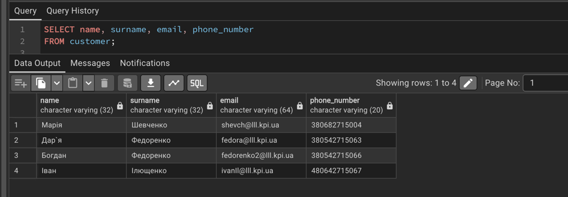

```sql
SELECT transaction_id, type, currency, amount, date, from_account_id, to_account_id
FROM transactions
WHERE amount >= 300;
```
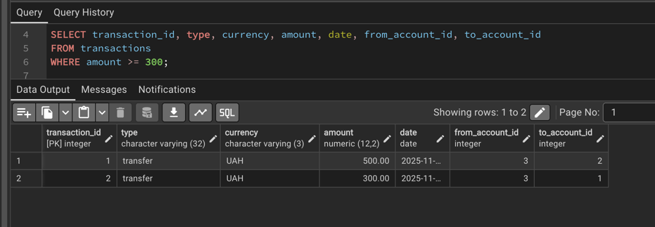

```sql
SELECT loan_id, amount, interest_rate, start_date, end_date
FROM loan
WHERE status = 'active' AND end_date > CAST('2026-01-01' AS DATE);
```
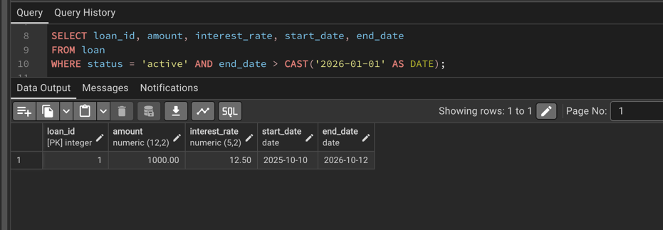

# INSERT

```sql
INSERT INTO customer(name, surname, email, phone_number)
VALUES ('Максим', 'Коваль', 'koval@lll.kpi.ua', '380501112233'),
       ('Катерина', 'Глеба', 'katya.gleba@lll.kpi.ua', '380671234567');

INSERT INTO account(iban, currency, balance, type, customer_id)
VALUES ('UA123456780000026004012345111', 'USD', 1500, 'saving', 5),
       ('UA998877660000026004012345222', 'EUR', 3200, 'deposit', 6);

INSERT INTO card(card_number, expiration_date, type, account_id)
VALUES ('5555444433332222', '2026-07-10', 'debit', 5),
       ('4444333322221111', '2027-01-01', 'credit', 6);

INSERT INTO transactions(type, currency, amount, date, from_account_id, to_account_id)
VALUES ('transfer', 'USD', 200, CURRENT_DATE, 5, 3),
       ('transfer', 'EUR', 450, CURRENT_DATE, 6, 1);

INSERT INTO loan(amount, interest_rate, start_date, end_date, status, account_id)
VALUES (2000, 11.0, '2023-02-15', '2024-02-15', 'closed', 5),
       (7500, 14.2, '2024-08-01', '2025-08-01', 'active', 6);
```

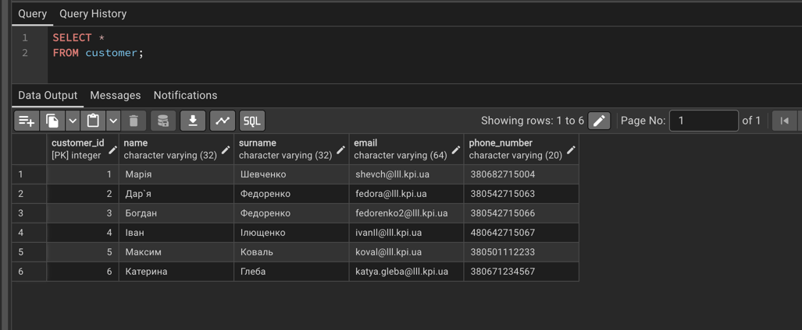
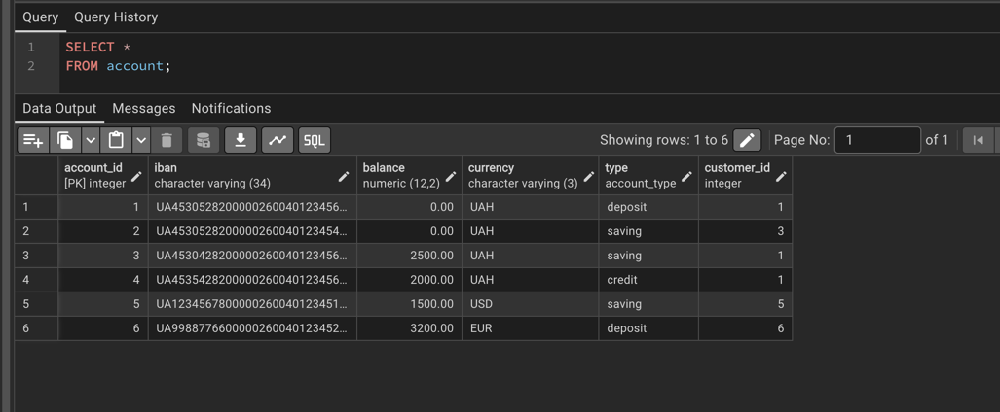
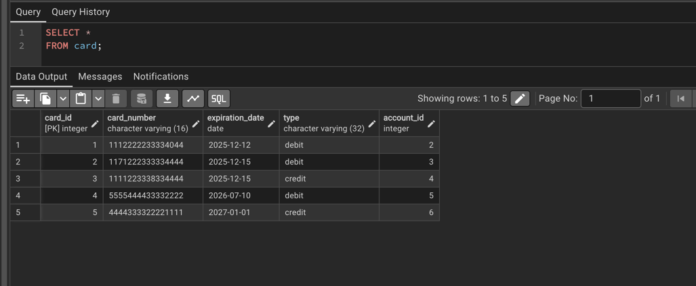
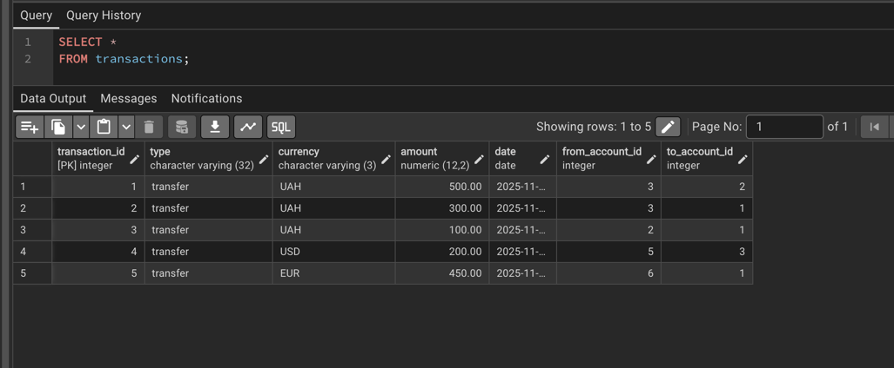
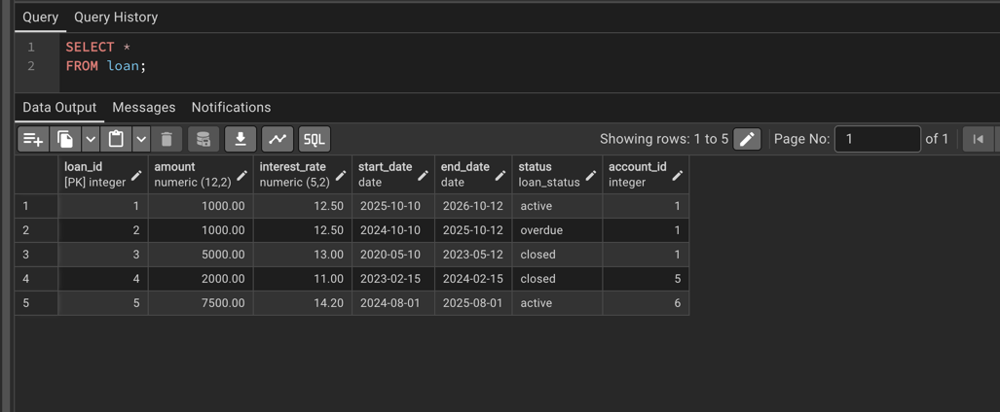

## UPDATE

```sql
UPDATE account
SET balance = balance + 500
WHERE account_id = 2;
```
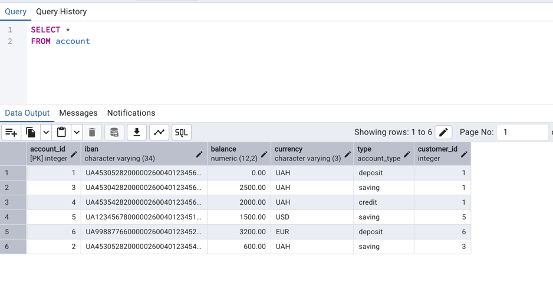
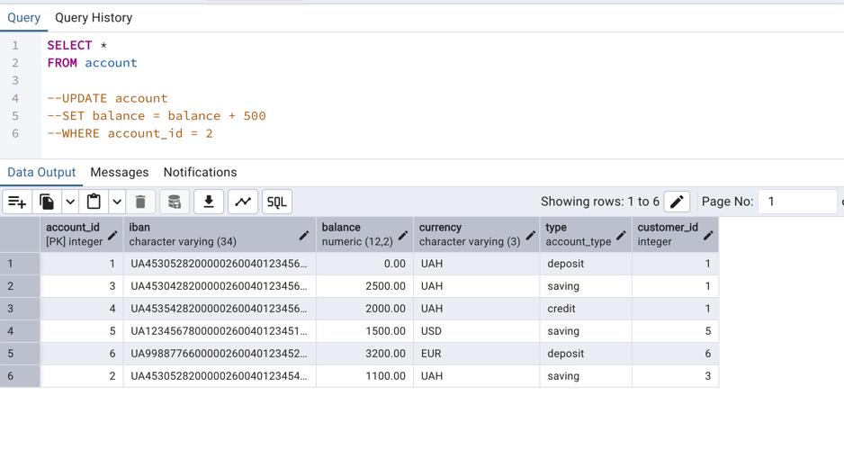

```sql
UPDATE customer
SET email = 'shevM@gmail.com', phone_number = '380501234500'
WHERE customer_id = 1;
```
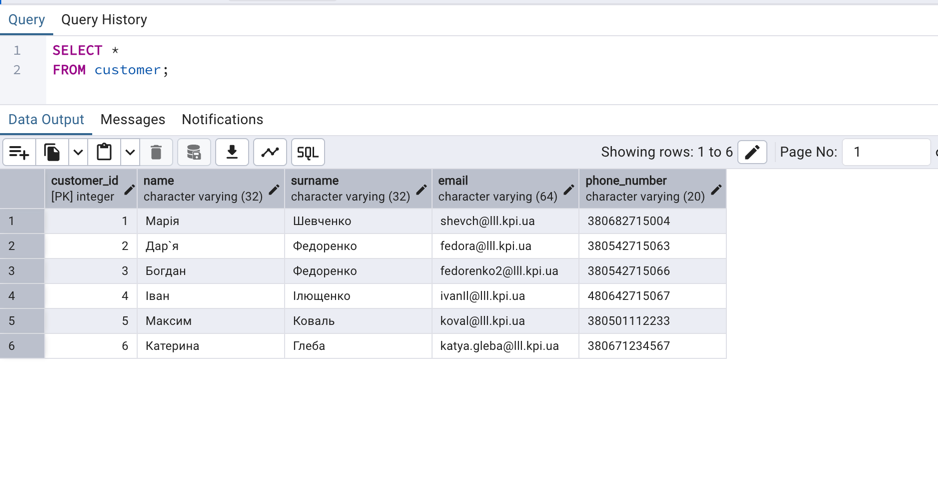
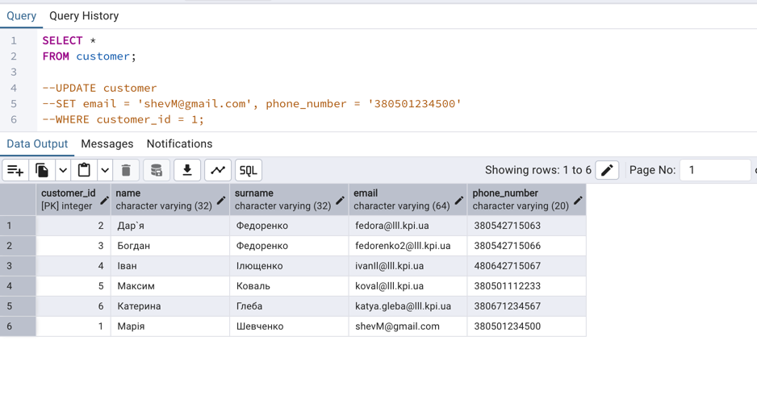


```sql
UPDATE loan
SET status = 'closed'
WHERE loan_id = 1;
```
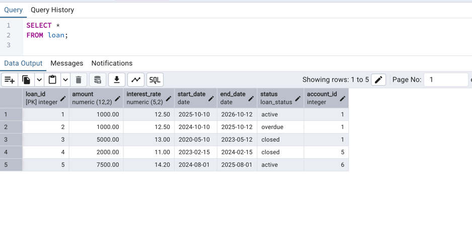
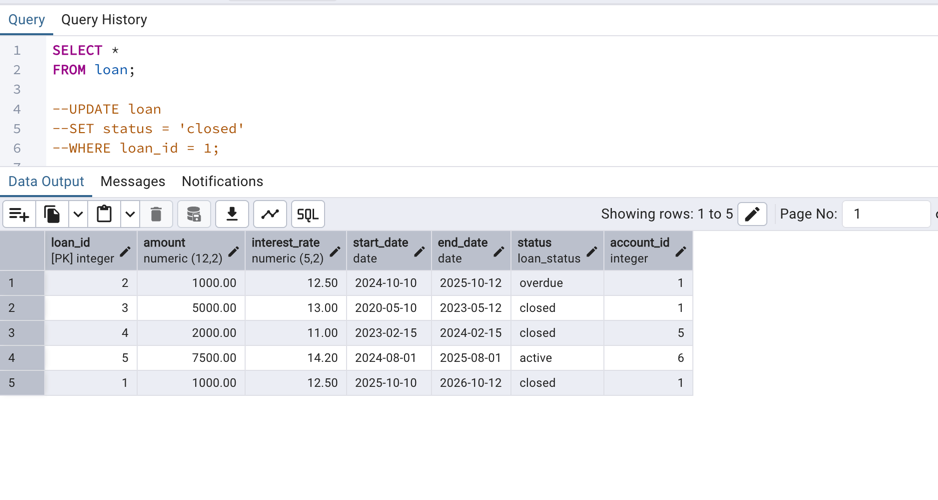

## DELETE

``` sql
DELETE FROM card
WHERE card_number = '1171222333334444';
```
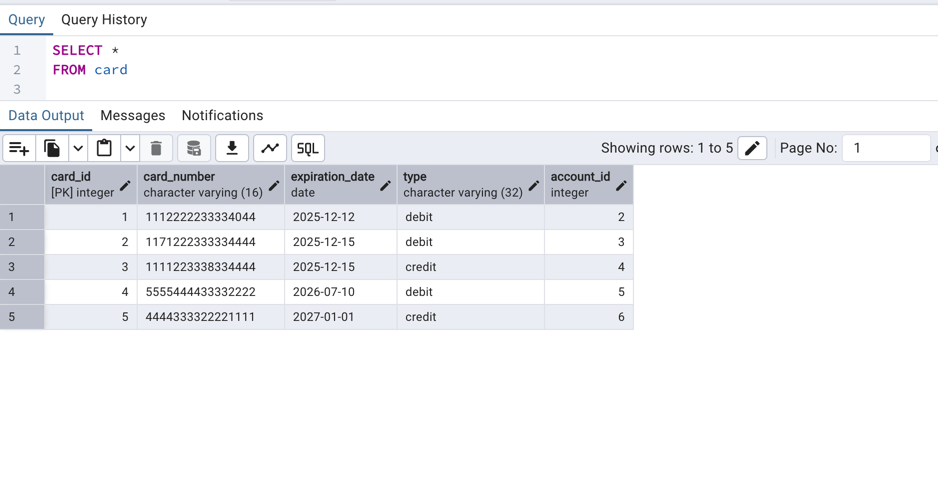
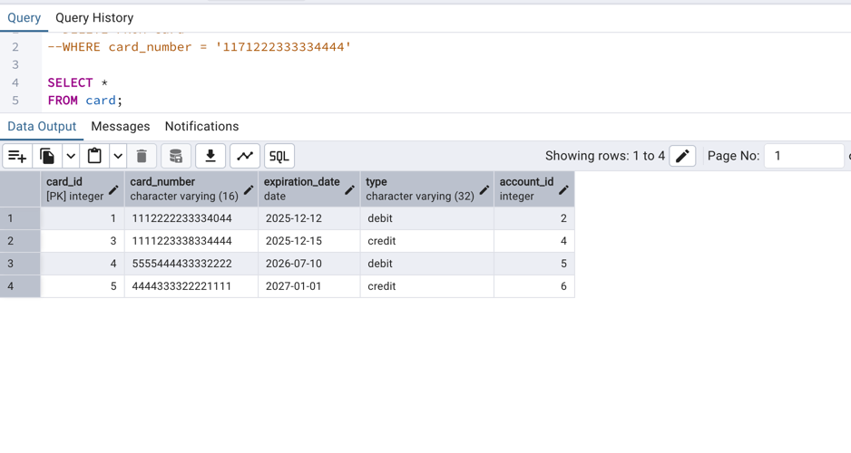

``` sql
DELETE FROM loan
WHERE status = 'closed' and account_id = 5;
```
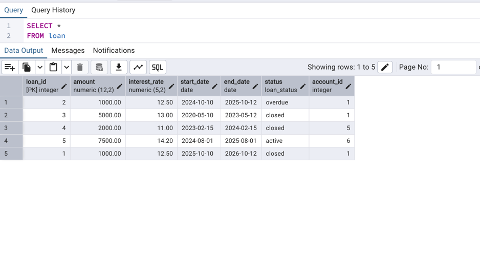
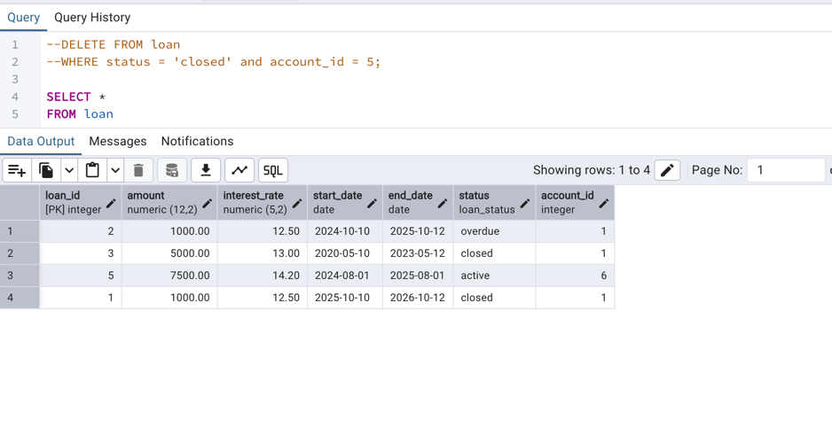
## Мета роботи
Розробити SQL DML-операції для роботи з даними бази банківської системи.  
Виконати вибірку, додавання, оновлення та видалення рядків у PostgreSQL.

---

## Опис системи
Система **онлайн-банкінгу** містить п'ять основних таблиць:

- **customer** – дані клієнтів
- **account** – банківські рахунки
- **card** – платіжні картки
- **transactions** – перекази між рахунками
- **loan** – кредитні зобов’язання клієнтів

Структура таблиць (DDL) була створена раніше у Лабораторній роботі №2.

---

# Структура бази даних

У проєкті реалізована база даних банківської системи, що складається з п’яти основних таблиць: **customer**, **account**, **card**, **transactions**, **loan**, а також двох користувацьких типів ENUM: **account_type** та **loan_status**.

---

## **1. customer**
Зберігає інформацію про клієнтів банку.

### **Стовпці**
- `customer_id` — SERIAL PRIMARY KEY
- `name` — VARCHAR(32), NOT NULL
- `surname` — VARCHAR(32), NOT NULL
- `email` — VARCHAR(64), UNIQUE, NOT NULL
- `phone_number` — VARCHAR(20), NOT NULL

### **Ключі та обмеження**
- `email` має бути унікальним — виключає дублювання клієнтів.
- Поля обов’язкові до заповнення.
- Є батьківською таблицею для `account` (зв’язок 1:N).

---

## **2. account**
Інформація про банківські рахунки.

### **Стовпці**
- `account_id` — SERIAL PRIMARY KEY
- `iban` — VARCHAR(34), UNIQUE, NOT NULL
- `balance` — DECIMAL(12,2), DEFAULT 0, CHECK(balance ≥ 0)
- `currency` — VARCHAR(3), NOT NULL
- `type` — ENUM(account_type), NOT NULL
- `customer_id` — FOREIGN KEY → customer(customer_id)

### **Ключі та обмеження**
- Баланс не може бути від’ємним.
- IBAN унікальний.
- Тип рахунку обмежений ENUM (`credit`, `saving`, `deposit`).
- Один клієнт може мати багато рахунків.

### **Припущення**
- Депозитний рахунок може починатися з нульового балансу.

---

## **3. card**
Зберігає платіжні картки клієнтів.

### **Стовпці**
- `card_id` — SERIAL PRIMARY KEY
- `card_number` — VARCHAR(16), UNIQUE, NOT NULL
- `expiration_date` — DATE, NOT NULL
- `type` — VARCHAR(32), NOT NULL
- `account_id` — FOREIGN KEY → account(account_id)

### **Ключі та обмеження**
- Номер картки унікальний.
- Картка належить лише одному рахунку.
- Один рахунок може мати багато карток.

### **Припущення**
- Тип картки не винесений у ENUM для гнучкості.

---

## **4. transactions**
Містить інформацію про всі перекази між рахунками.

### **Стовпці**
- `transaction_id` — SERIAL PRIMARY KEY
- `type` — VARCHAR(32), NOT NULL
- `currency` — VARCHAR(3), NOT NULL
- `amount` — DECIMAL(12,2), CHECK(amount > 0)
- `date` — DATE, DEFAULT CURRENT_DATE, NOT NULL
- `from_account_id` — FOREIGN KEY → account(account_id)
- `to_account_id` — FOREIGN KEY → account(account_id)

### **Ключі та обмеження**
- Сума транзакції повинна бути додатною.
- Може бути внутрішній переказ (from = to).
- Забезпечує зв’язок рахунків як відправника, так і отримувача.

### **Припущення**
- Тип транзакції (`payment`, `transfer`, etc.) зберігається у вигляді тексту.

---

## **5. loan**
Зберігає інформацію про кредити клієнтів.

### **Стовпці**
- `loan_id` — SERIAL PRIMARY KEY
- `amount` — DECIMAL(12,2), NOT NULL
- `interest_rate` — DECIMAL(5,2), CHECK(0 ≤ interest_rate ≤ 100)
- `start_date` — DATE, NOT NULL
- `end_date` — DATE, NOT NULL
- `status` — ENUM(loan_status), NOT NULL
- `account_id` — FOREIGN KEY → account(account_id)

### **Ключі та обмеження**
- Контроль процентної ставки через CHECK.
- Статус обмежений ENUM (`active`, `closed`, `overdue`).
- Один рахунок може мати кілька позик.

### **Припущення**
- `overdue` не обчислюється автоматично — статус задається вручну для навчальних потреб.

---

## **Загальна схема зв'язків**

| Зв’язок | Тип | Опис |
|--------|------|-------|
| Customer → Account | 1 : N | Один клієнт може мати кілька рахунків |
| Account → Card | 1 : N | Один рахунок може мати кілька карток |
| Account → Transactions | 1 : N | Рахунок може бути відправником або отримувачем |
| Account → Loan | 1 : N | Один рахунок може мати кілька кредитів |

---

## **Логічні зв’язки в системі**
- Клієнт створює рахунок → до нього може бути випущено кілька карток.
- Через рахунок здійснюються транзакції.
- Клієнт може оформити одну або кілька позик.
- Всі зовнішні ключі забезпечують цілісність даних:  
  не можна створити рахунок без клієнта або платежі без рахунків.

---

## SELECT

```sql
SELECT name, surname, email, phone_number
FROM customer;
```


```sql
SELECT transaction_id, type, currency, amount, date, from_account_id, to_account_id
FROM transactions
WHERE amount >= 300;
```


```sql
SELECT loan_id, amount, interest_rate, start_date, end_date
FROM loan
WHERE status = 'active' AND end_date > CAST('2026-01-01' AS DATE);
```


# INSERT

```sql
INSERT INTO customer(name, surname, email, phone_number)
VALUES ('Максим', 'Коваль', 'koval@lll.kpi.ua', '380501112233'),
       ('Катерина', 'Глеба', 'katya.gleba@lll.kpi.ua', '380671234567');

INSERT INTO account(iban, currency, balance, type, customer_id)
VALUES ('UA123456780000026004012345111', 'USD', 1500, 'saving', 5),
       ('UA998877660000026004012345222', 'EUR', 3200, 'deposit', 6);

INSERT INTO card(card_number, expiration_date, type, account_id)
VALUES ('5555444433332222', '2026-07-10', 'debit', 5),
       ('4444333322221111', '2027-01-01', 'credit', 6);

INSERT INTO transactions(type, currency, amount, date, from_account_id, to_account_id)
VALUES ('transfer', 'USD', 200, CURRENT_DATE, 5, 3),
       ('transfer', 'EUR', 450, CURRENT_DATE, 6, 1);

INSERT INTO loan(amount, interest_rate, start_date, end_date, status, account_id)
VALUES (2000, 11.0, '2023-02-15', '2024-02-15', 'closed', 5),
       (7500, 14.2, '2024-08-01', '2025-08-01', 'active', 6);
```


## UPDATE

```sql
UPDATE account
SET balance = balance + 500
WHERE account_id = 2;
```


```sql
UPDATE customer
SET email = 'shevM@gmail.com', phone_number = '380501234500'
WHERE customer_id = 1;
```


```sql
UPDATE loan
SET status = 'closed'
WHERE loan_id = 1;
```


## DELETE 

``` sql
DELETE FROM card
WHERE card_number = '1171222333334444';
```


``` sql
DELETE FROM loan
WHERE status = 'closed' and account_id = 5;
```

