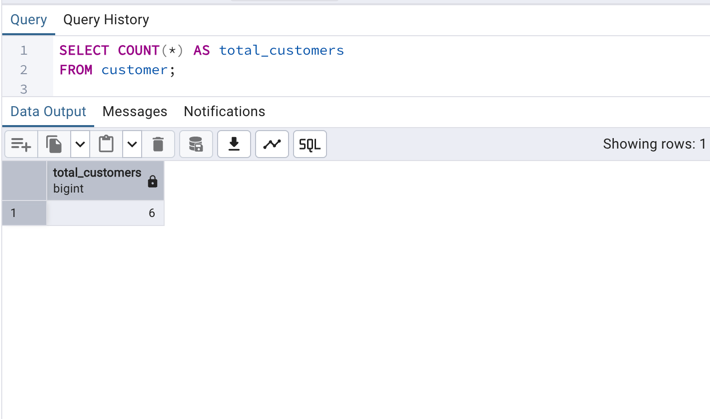
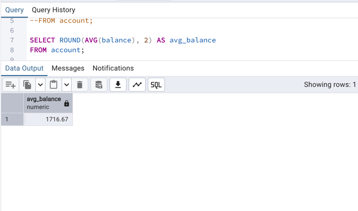
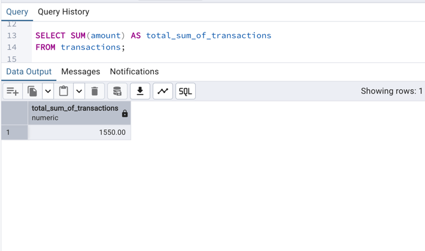
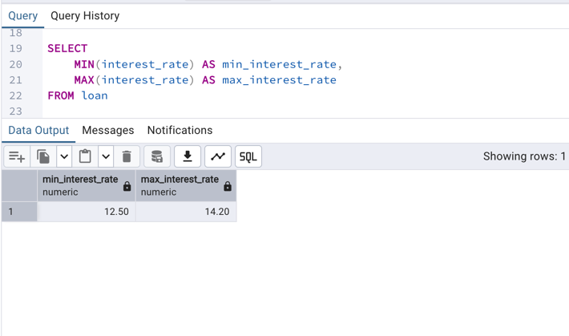
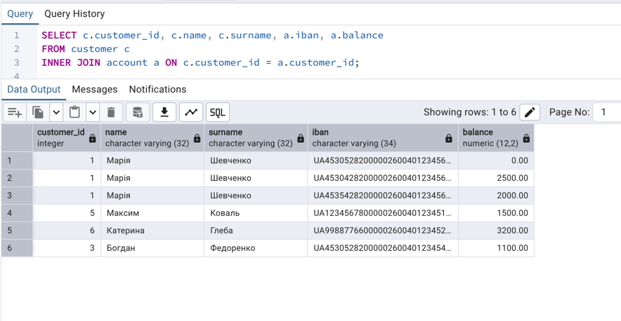
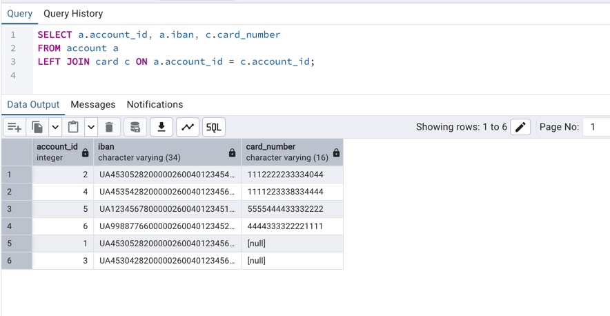
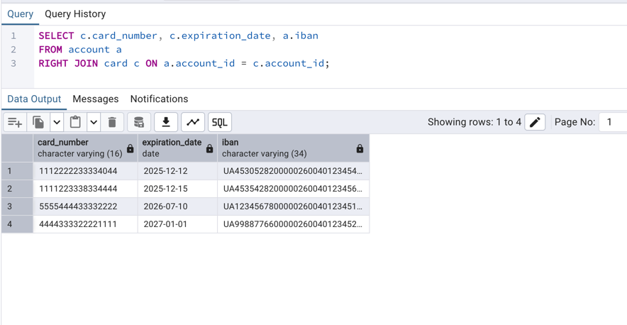
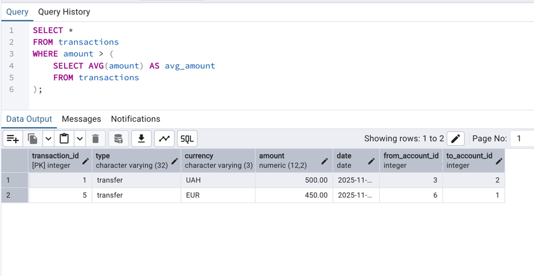
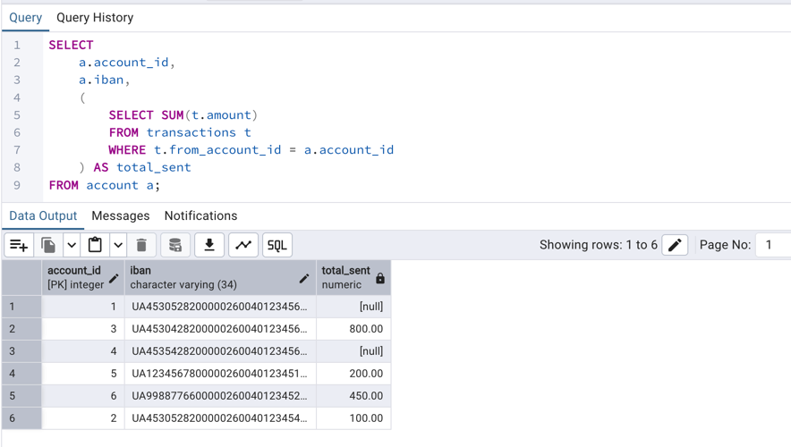
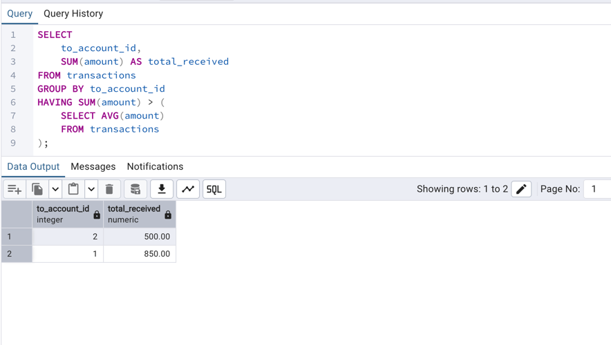

# Lab 4

## Аналітичні SQL-запити (OLAP)

---

Мета роботи
* Навчитися застосовувати оператори SQL для вибірки, агрегації та об’єднання даних.
* Закріпити навички роботи з агрегатними функціями (COUNT, SUM, AVG, MIN, MAX).
* Виконати запити з GROUP BY, HAVING, різними типами JOIN.
* Навчитися використовувати підзапити (subqueries) у WHERE, SELECT, HAVING.

# 1. Агрегаційні функції

### 1.1 Загальна кількість клієнтів
```sql
SELECT COUNT(*) AS total_customers
FROM customer;
```


### 1.2 Середній баланс по рахунках
```sql
SELECT ROUND(AVG(balance), 2) AS avg_balance
FROM account;
```


### 1.3 Загальна сума всіх транзакцій

```sql
SELECT SUM(amount) AS total_sum_of_transactions
FROM transactions;
```


### 1.4 Мінімальна та максимальна відсоткова ставка
```sql
SELECT
    MIN(interest_rate) AS min_interest_rate,
    MAX(interest_rate) AS max_interest_rate
FROM loan
```


# 2. JOIN-запити

### 2.1 INNER JOIN — клієнт та його рахунки

```sql
SELECT c.customer_id, c.name, c.surname, a.iban, a.balance
FROM customer c
INNER JOIN account a ON c.customer_id = a.customer_id;
```


### 2.2 LEFT JOIN — усі рахунки, навіть без карток

```sql
SELECT a.account_id, a.iban, c.card_number
FROM account a
LEFT JOIN card c ON a.account_id = c.account_id;
```


### 2.3 RIGHT JOIN — усі картки, навіть без привʼязаного рахунку
```sql
SELECT c.card_number, c.expiration_date, a.iban
FROM account a
RIGHT JOIN card c ON a.account_id = c.account_id;
```


# 3. Підзапити

### 3.1 Транзакції, більші за середню суму

```sql
SELECT *
FROM transactions
WHERE amount > (
    SELECT AVG(amount) AS avg_amount
    FROM transactions
);
```


### 3.2 Загальна сума відправлених коштів з кожного рахунку
```sql
SELECT
    a.account_id,
    a.iban,
    (
        SELECT SUM(t.amount)
        FROM transactions t
        WHERE t.from_account_id = a.account_id
    ) AS total_sent
FROM account a;
```


### 3.3 Групування + HAVING з підзапитом
```sql 
SELECT
    to_account_id,
    SUM(amount) AS total_received
FROM transactions
GROUP BY to_account_id
HAVING SUM(amount) > (
    SELECT AVG(amount)
    FROM transactions
);
```


# Дані в таблицях


