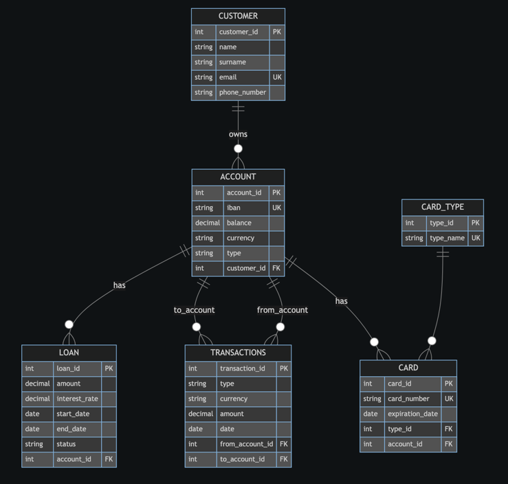

# Лабораторна робота 5: Нормалізація бази даних

## 1. Вступ

У попередніх лабораторних роботах (Lab2–Lab4) я спроєктувала базу даних для простої банківської системи.  
Схема включає такі таблиці:

- `customer` — клієнти
- `account` — рахунки
- `card` — платіжні картки
- `transactions` — транзакції
- `loan` — позики

Більшість таблиць одразу були спроєктовані з урахуванням нормалізації, тому серйозних проблем з 1NF/2NF у них немає.  
Для цієї лабораторної роботи я свідомо обрав **одну таблицю — `card`**, в якій є **транзитивна залежність**, і показала, як її можна довести до 3NF.

---

## 2. Вихідна схема (фрагмент)

Нижче наведено спрощений фрагмент схеми, який стосується таблиці `card`:

```sql
CREATE TABLE IF NOT EXISTS customer (
    customer_id SERIAL PRIMARY KEY,
    name        VARCHAR(32) NOT NULL,
    surname     VARCHAR(32) NOT NULL,
    email       VARCHAR(64) NOT NULL UNIQUE,
    phone_number VARCHAR(20) NOT NULL
);

CREATE TABLE IF NOT EXISTS account (
    account_id SERIAL PRIMARY KEY,
    iban       VARCHAR(34) NOT NULL UNIQUE,
    balance    DECIMAL(12, 2) DEFAULT 0 CHECK (balance >= 0),
    currency   VARCHAR(3) NOT NULL,
    type       account_type NOT NULL,
    customer_id INT REFERENCES customer (customer_id)
);

CREATE TABLE IF NOT EXISTS card (
    card_id         SERIAL PRIMARY KEY,
    card_number     VARCHAR(16) NOT NULL UNIQUE,
    expiration_date DATE NOT NULL,
    type            VARCHAR(32) NOT NULL,
    account_id      INT REFERENCES account (account_id)
);
```

## 3. Аналіз таблиці card

### 3.1. Структура вихідної таблиці

```sql
CREATE TABLE IF NOT EXISTS card (
    card_id         SERIAL PRIMARY KEY,
    card_number     VARCHAR(16) NOT NULL UNIQUE,
    expiration_date DATE NOT NULL,
    type            VARCHAR(32) NOT NULL,
    account_id      INT REFERENCES account (account_id)
);
```

Атрибути:
* card_id - первинний ключ (PK)
* card_number - унікальний номер картки
* expiration_date - дата завершення дії картки
* type - тип картки (наприклад, 'debit', 'credit')
* account_id - зовнішній ключ (account.account_id)

### 3.2. Функціональні залежності (ФЗ) для card (до нормалізації)

card_id → card_number  
card_id → expiration_date  
card_id → type  
card_id → account_id

card_number → expiration_date  
card_number → type  
card_number → account_id

Транзитивна залежність через те, що:
* card_id -> card_number
* card_number -> type

ми отримуємо транзитивну залежність:

card_id -> card_number -> type

Це порушує 3NF, тому що неключовий атрибут type залежить від іншого неключового атрибута card_number, а не напряму від ключа card_id.

### 3.3. Перевірка нормальних форм


### 1NF

Усі атрибути атомарні -> 1NF виконується.

### 2NF

Первинний ключ — простий (card_id), тому часткових залежностей немає -> 2NF виконується.

### 3NF - порушена

Через транзитивну залежність:

card_id -> card_number -> type

### Аномалії в таблиці card

Через те, що type - звичайний текстовий стовпець, який повторюється, виникають типові аномалії:
1.	Аномалія вставки (INSERT)
      Не можна завести новий тип картки окремо - він з’явиться у схемі лише тоді, коли буде доданий хоча б один рядок card з цим typом.
2.	Аномалія оновлення (UPDATE)
      Якщо, наприклад, потрібно перейменувати тип 'credit' -> 'credit_card', доведеться оновлювати всі рядки, де він зустрічається. Якщо один рядок пропустити - отримаємо неконсистентні дані.
3.	Аномалія видалення (DELETE)
      Якщо видалити останню картку певного типу, інформація про цей тип «зникне» з бази, хоча логічно тип може ще використовуватися для майбутніх карток.

## 4. Нормалізація таблиці card до 3NF

### 4.1. Крок 1 - Винесення типу картки (type) у таблицю card_type

Створюю нову таблицю:

```sql
CREATE TABLE card_type (
    type_id   SERIAL PRIMARY KEY,
    type_name VARCHAR(32) UNIQUE NOT NULL
);
```
Тут:
* type_id - PK
* type_name - назва типу картки, унікальна ('debit', 'credit' тощо)

### 4.2. Крок 2 - Оновлення таблиці card

Замість текстового поля type у card зберігаємо тільки посилання на card_type:

```sql
CREATE TABLE card (
    card_id         SERIAL PRIMARY KEY,
    card_number     VARCHAR(16) NOT NULL UNIQUE,
    expiration_date DATE NOT NULL,
    type_id         INT REFERENCES card_type(type_id),
    account_id      INT REFERENCES account(account_id)
);
```
Тепер:
фактично усі типи карток в card_type, а card містить тільки зовнішній ключ type_id.

## 5. ALTER TABLE (міграція з існуючих даних)

### 5.1. Створення нової таблиці card_type

```sql
CREATE TABLE card_type (
    type_id   SERIAL PRIMARY KEY,
    type_name VARCHAR(32) UNIQUE NOT NULL
);
```
```sql
INSERT INTO card_type (type_name)
VALUES ('debit'), ('credit');
```

### 5.2. Додавання нового стовпця type_id у таблицю card
```sql
ALTER TABLE card
ADD COLUMN type_id INT;
```

### 5.3. Заповнення нового стовпця правильними значеннями
```sql
UPDATE card
SET type_id = (
    SELECT type_id
    FROM card_type
    WHERE card_type.type_name = card.type
);
```

### 5.4. Видалення старого атрибуту type
```sql
ALTER TABLE card
DROP COLUMN type;
```

### 5.5. Додавання зовнішнього ключа для нового стовпця
```sql
ALTER TABLE card
ALTER COLUMN type_id SET NOT NULL;

ALTER TABLE card
ADD CONSTRAINT fk_card_type
FOREIGN KEY (type_id) REFERENCES card_type(type_id);
```

## 6. Новий фінальний дизайн таблиць (після нормалізації)

```sql
CREATE TABLE card_type (
    type_id   SERIAL PRIMARY KEY,
    type_name VARCHAR(32) UNIQUE NOT NULL
);
```

```sql
CREATE TABLE card (
    card_id         SERIAL PRIMARY KEY,
    card_number     VARCHAR(16) UNIQUE NOT NULL,
    expiration_date DATE NOT NULL,
    type_id         INT NOT NULL REFERENCES card_type(type_id),
    account_id      INT REFERENCES account(account_id)
);
```

## 7. ER-діаграма після нормалізації (Mermaid)




