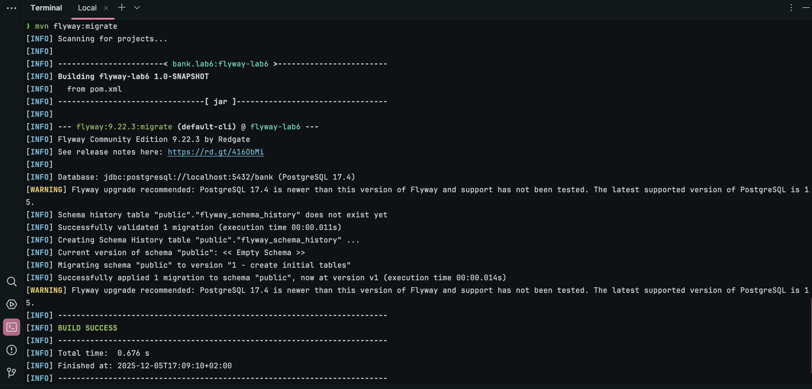
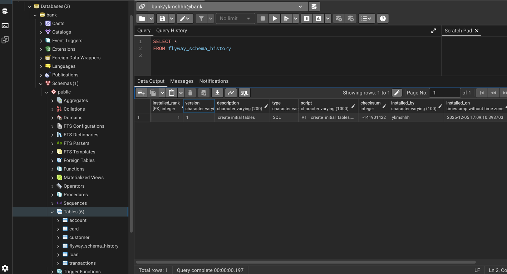
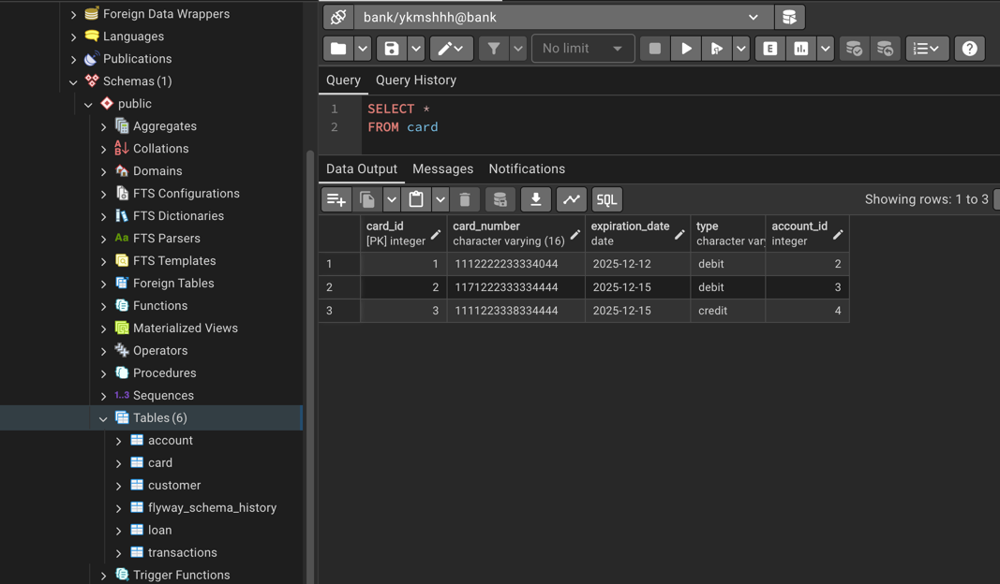
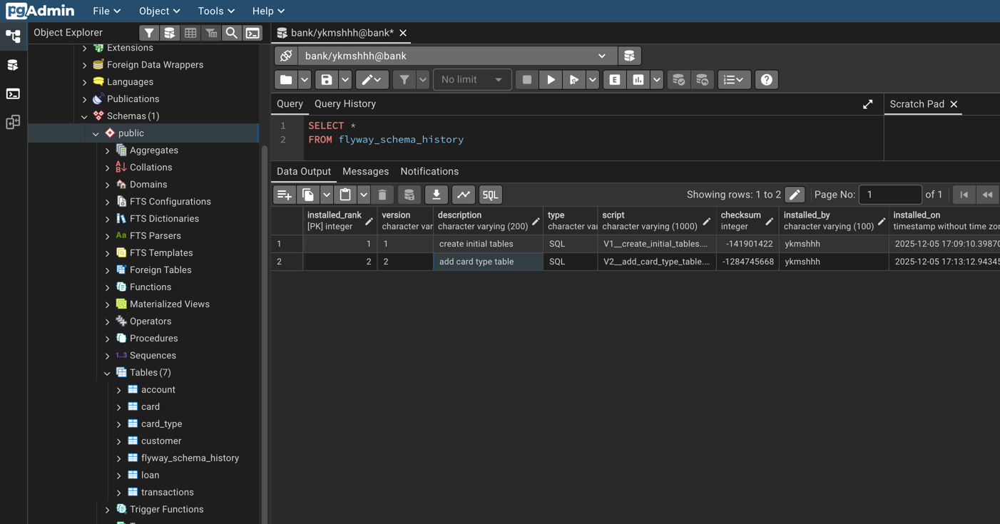
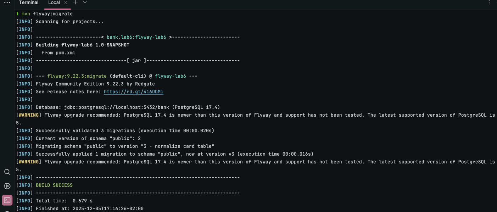
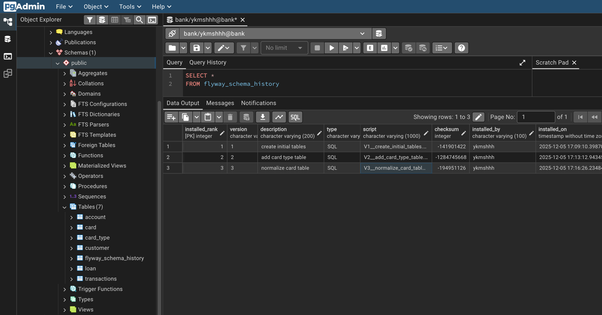
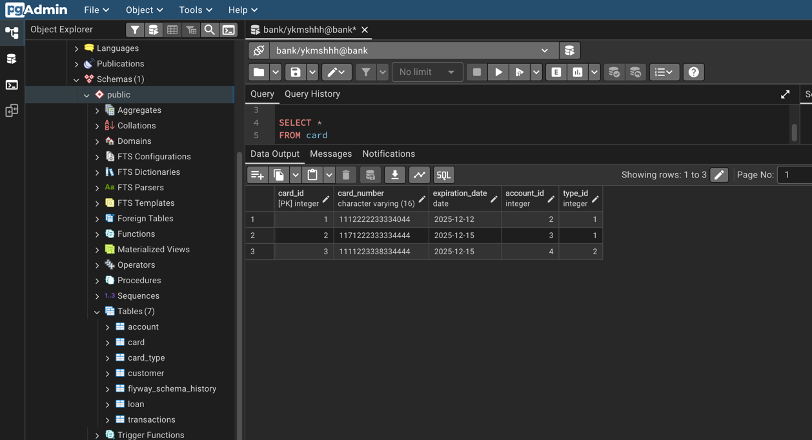
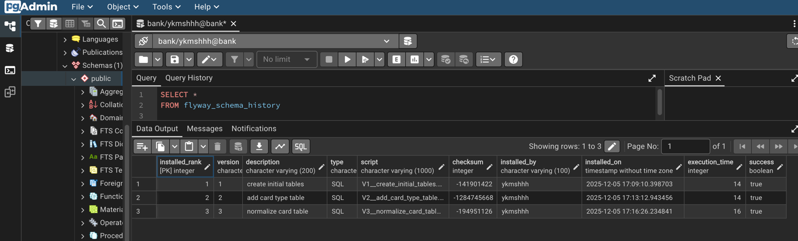

# Лабораторна робота 6: Міграції схем за допомогою Flyway ORM

У цій лабораторній роботі я застосувала інструмент Flyway для керування схемою бази даних.
Я підключила Flyway до своєї бази та створила три послідовні версії міграцій.

## Підключення Flyway

[pom.xml](pom.xml)
```xml
    <build>
        <plugins>
            <plugin>
                <groupId>org.flywaydb</groupId>
                <artifactId>flyway-maven-plugin</artifactId>
                <version>9.22.3</version>
                <configuration>
                    <url>jdbc:postgresql://localhost:5432/bank</url>
                    <user>ykmshhh</user>
                    <password>bank123</password>
                    <schemas>
                        <schema>public</schema>
                    </schemas>
                </configuration>
            </plugin>
        </plugins>
    </build>
```

## Міграції

### Міграція V1 - створення таблиць

[V1__create_initial_tables.sql](src/main/resources/db/migration/V1__create_initial_tables.sql)
```sql
CREATE TYPE account_type AS ENUM('credit', 'saving', 'deposit');

CREATE TYPE loan_status AS ENUM('active', 'closed', 'overdue');

CREATE TABLE customer (
                          customer_id SERIAL PRIMARY KEY,
                          name VARCHAR(32) NOT NULL,
                          surname VARCHAR(32) NOT NULL,
                          email VARCHAR(64) NOT NULL UNIQUE,
                          phone_number VARCHAR(20) NOT NULL
);

CREATE TABLE account (
                         account_id SERIAL PRIMARY KEY,
                         iban VARCHAR(34) NOT NULL UNIQUE,
                         balance DECIMAL(12, 2) DEFAULT 0 CHECK(balance >= 0),
                         currency VARCHAR(3) NOT NULL,
                         type account_type NOT NULL,
                         customer_id INT REFERENCES customer(customer_id)
);

CREATE TABLE card (
                      card_id SERIAL PRIMARY KEY,
                      card_number VARCHAR(16) NOT NULL UNIQUE,
                      expiration_date DATE NOT NULL,
                      type VARCHAR(32) NOT NULL,
                      account_id INT REFERENCES account(account_id)
);

CREATE TABLE transactions (
                              transaction_id SERIAL PRIMARY KEY,
                              type VARCHAR(32) NOT NULL,
                              currency VARCHAR(3) NOT NULL,
                              amount DECIMAL(12, 2) NOT NULL CHECK (amount > 0),
                              date DATE NOT NULL DEFAULT CURRENT_DATE,
                              from_account_id INT REFERENCES account(account_id),
                              to_account_id INT REFERENCES account(account_id)
);

CREATE TABLE loan (
                      loan_id SERIAL PRIMARY KEY,
                      amount DECIMAL(12, 2) NOT NULL,
                      interest_rate DECIMAL(5, 2) CHECK (interest_rate >= 0 AND interest_rate <= 100),
                      start_date DATE NOT NULL,
                      end_date DATE NOT NULL,
                      status loan_status NOT NULL,
                      account_id INT REFERENCES account(account_id)
);
```




## Міграція V2 - додавання таблиці card_type

[V2__add_card_type_table.sql](src/main/resources/db/migration/V2__add_card_type_table.sql)
```sql
CREATE TABLE card_type (
                           type_id SERIAL PRIMARY KEY,
                           type_name VARCHAR(32) UNIQUE NOT NULL
);

INSERT INTO card_type (type_name)
VALUES ('debit'), ('credit');
```



## Міграція V3 - нормалізація таблиці card

[V3__normalize_card_table.sql](src/main/resources/db/migration/V3__normalize_card_table.sql)
```sql
ALTER TABLE card
ADD COLUMN type_id INTEGER;

UPDATE card
SET type_id = (
    SELECT type_id
    FROM card_type
    WHERE card_type.type_name = card.type
    );

ALTER TABLE card
DROP column type;

ALTER TABLE card
ALTER COLUMN type_id SET NOT NULL;

ALTER TABLE card
ADD CONSTRAINT fk_card_type
FOREIGN KEY (type_id) REFERENCES card_type(type_id);
```




## Історія міграцій


